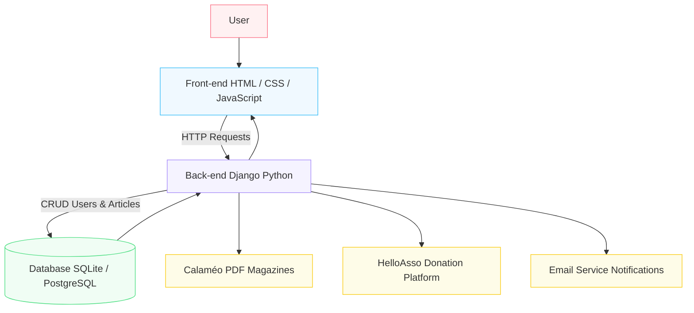
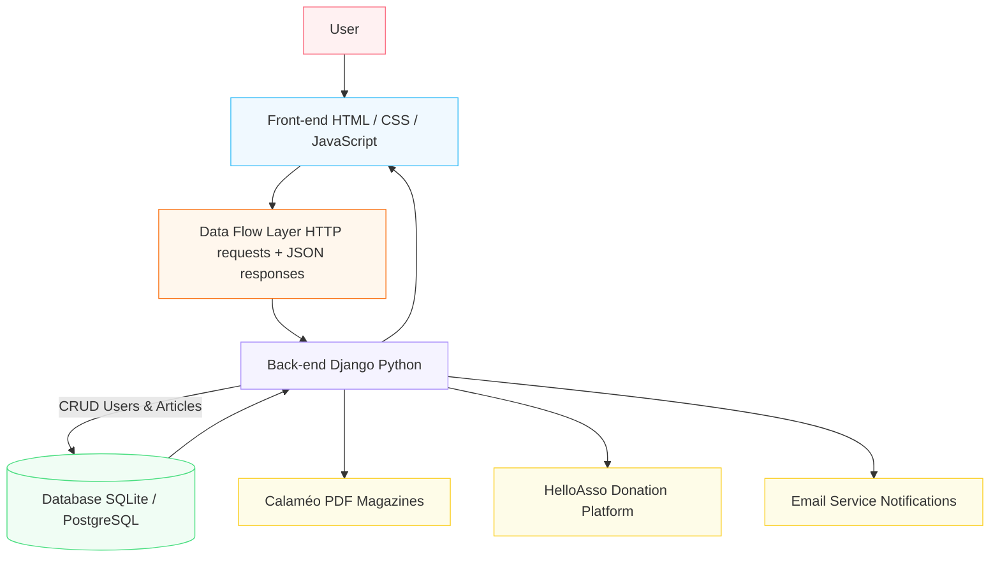
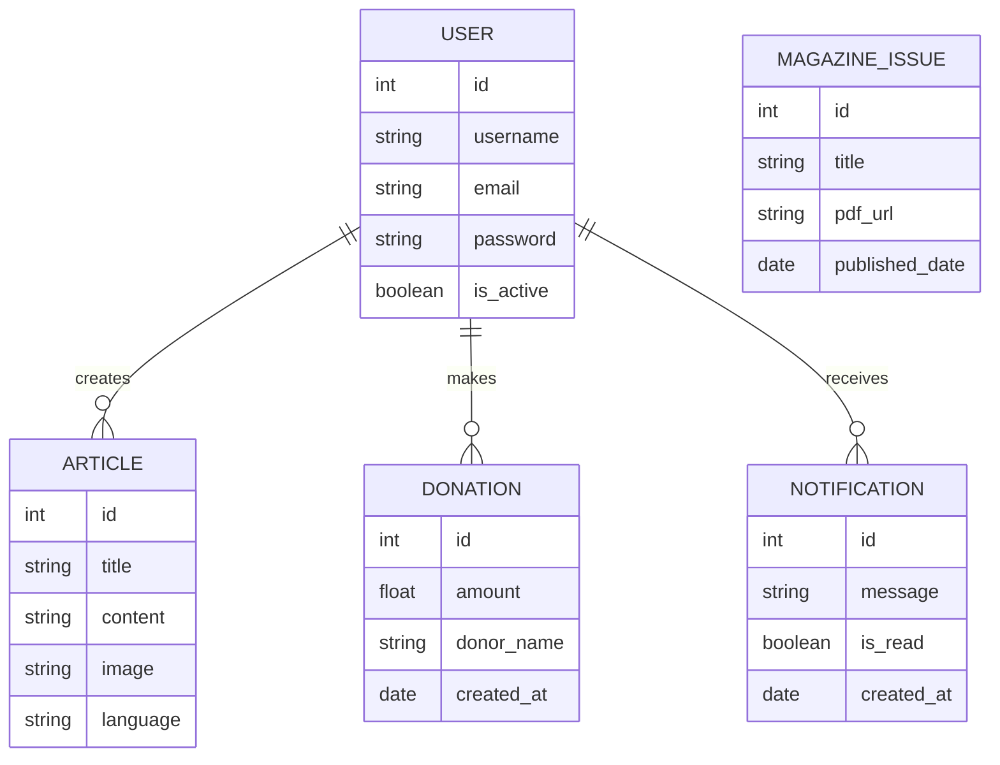
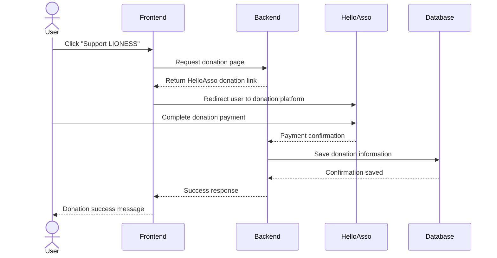

# Portfolio Lioness Magazine

## System Architecture

```mermaid
flowchart TD

U[User]
FE[Front-end HTML / CSS / JavaScript]
BE[Back-end Django Python]
DB[(Database SQLite / PostgreSQL)]

CAL[Calaméo PDF Magazines]
HELLOASSO[HelloAsso Donation Platform]
EMAIL[Email Service Notifications]

U --> FE
FE -->|HTTP Requests| BE

BE -->|CRUD Users & Articles| DB
DB --> BE
BE --> FE

BE --> CAL
BE --> HELLOASSO
BE --> EMAIL

classDef userNode stroke:#fb7185,fill:#fff1f2
classDef frontendNode stroke:#38bdf8,fill:#f0f9ff
classDef backendNode stroke:#a78bfa,fill:#f5f3ff
classDef databaseNode stroke:#4ade80,fill:#f0fdf4
classDef externalNode stroke:#facc15,fill:#fefce8

class U userNode
class FE frontendNode
class BE backendNode
class DB databaseNode
class CAL externalNode
class HELLOASSO externalNode
class EMAIL externalNode
```

## DATA FLOW DIAGRAM

```mermaid
flowchart TD

U[User]

FE[Front-end HTML / CSS / JavaScript]
BE[Back-end Django Python]
DB[(Database SQLite / PostgreSQL)]

CAL[Calaméo PDF Magazines]
HELLOASSO[HelloAsso Donation Platform]
EMAIL[Email Service Notifications]

DF[Data Flow Layer HTTP requests + JSON responses]

U --> FE
FE --> DF
DF --> BE

BE -->|CRUD Users & Articles| DB
DB --> BE

BE --> FE

BE --> CAL
BE --> HELLOASSO
BE --> EMAIL

classDef userNode stroke:#fb7185,fill:#fff1f2
classDef frontendNode stroke:#38bdf8,fill:#f0f9ff
classDef backendNode stroke:#a78bfa,fill:#f5f3ff
classDef databaseNode stroke:#4ade80,fill:#f0fdf4
classDef externalNode stroke:#facc15,fill:#fefce8
classDef dataflowNode stroke:#f97316,fill:#fff7ed

class U userNode
class FE frontendNode
class BE backendNode
class DB databaseNode
class CAL externalNode
class HELLOASSO externalNode
class EMAIL externalNode
class DF dataflowNode
```

## ER DIAGRAM

```mermaid
erDiagram

USER ||--o{ ARTICLE : creates
USER ||--o{ DONATION : makes
USER ||--o{ NOTIFICATION : receives

USER {
  int id
  string username
  string email
  string password
  boolean is_active
}

ARTICLE {
  int id
  string title
  string content
  string image
  string language
}

MAGAZINE_ISSUE {
  int id
  string title
  string pdf_url
  date published_date
}

DONATION {
  int id
  float amount
  string donor_name
  date created_at
}

NOTIFICATION {
  int id
  string message
  boolean is_read
  date created_at
}
```

## 3. SEQUENCE DIAGRAM — DONATION (HelloAsso)

```mermaid
sequenceDiagram

actor User
participant Frontend
participant Backend
participant HelloAsso
participant Database

User->>Frontend: Click "Support LIONESS"
Frontend->>Backend: Request donation page
Backend-->>Frontend: Return HelloAsso donation link

Frontend->>HelloAsso: Redirect user to donation platform

User->>HelloAsso: Complete donation payment

HelloAsso-->>Backend: Payment confirmation
Backend->>Database: Save donation information

Database-->>Backend: Confirmation saved
Backend-->>Frontend: Success response
Frontend-->>User: Donation success message
```

