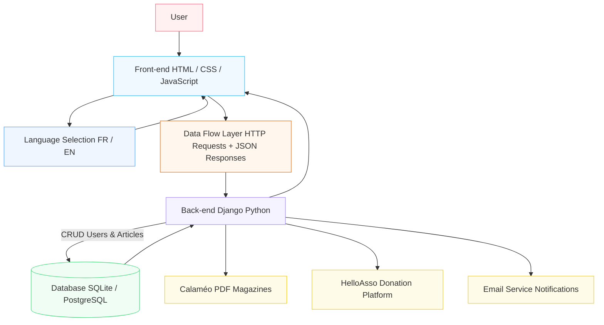
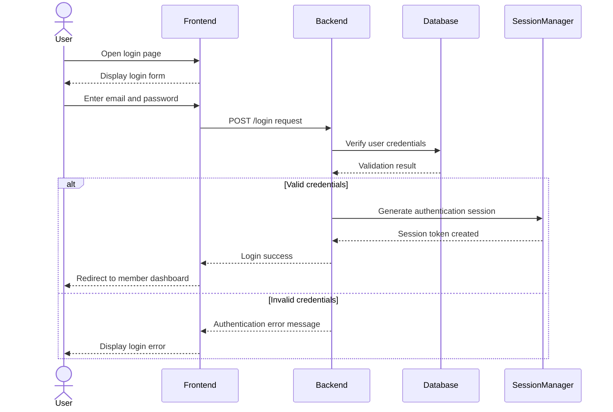
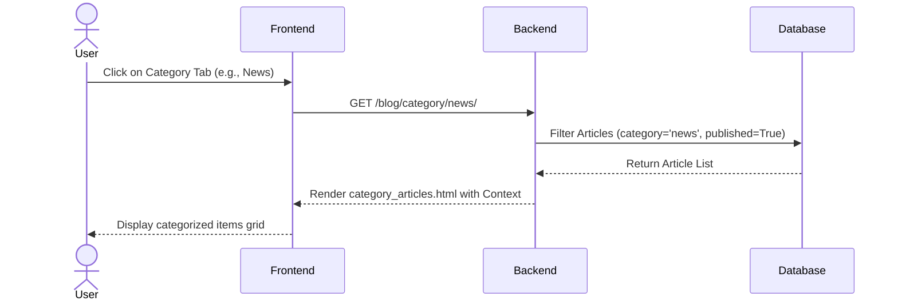
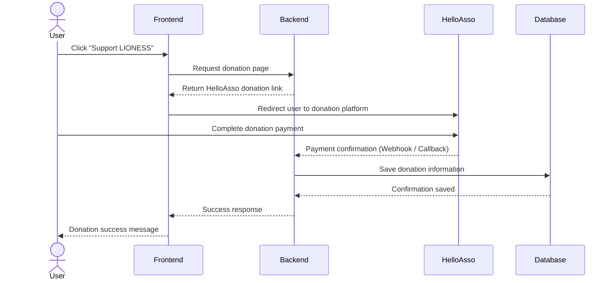

# LIONESS – The Magazine for Queens

LIONESS is a bilingual (French/English) digital platform designed to promote, celebrate, and empower African and Afro-descendant women through inspiring content, entrepreneurship, community engagement, and digital publications.

The platform provides comprehensive access to the LIONESS digital magazine, member registration, a secure personalized dashboard, and direct organizational support through integrated donation workflows.

---

## 📖 Table of Contents

- [Project Overview](#-project-overview)
- [Features](#-features)
- [MVP Scope](#-mvp-scope)
- [Technologies Used](#-technologies-used)
- [Application Architecture](#-application-architecture)
- [Database Design & ERD](#-database-design)
- [Project Structure](#-project-structure)
- [Installation Guide](#-installation-guide)
- [Environment Configuration](#-environment-configuration)
- [Running the Project](#-running-the-project)
- [Authentication System](#-authentication-system)
- [Internationalization (i18n)](#-internationalization-i18n)
- [Security Measures](#-security-measures)
- [Testing Strategy](#-testing-strategy)
- [Git Workflow](#-git-workflow)
- [Technical Decisions](#-technical-decisions)
- [Screenshots](#-screenshots)
- [Team Collaboration](#-team-collaboration)
- [License](#-license)

---

# Portfolio Lioness Magazine

## System Architecture



## ER DIAGRAM

```mermaid
erDiagram
    USER ||--o{ PROFILE : has
    USER ||--o{ DONATION : makes
    USER ||--o{ NOTIFICATION : receives
    
    USER {
        int id PK
        string username
        string email
        string password
        string first_name
        string last_name
        boolean is_active
        datetime date_joined
    }

    PROFILE {
        int id PK
        int user_id FK
        string country
        string occupation
        string profile_picture
        text bio
        datetime created_at
        datetime updated_at
    }

    ARTICLE {
        int id PK
        string title
        string author
        text content
        string image
        string category
        boolean published
        datetime created_at
    }
```

    ----

## 1. Sequence Diagram — User Login



---

## 2. SEQUENCE DIAGRAM — RETRIEVE ARTICLES BY CATEGORY


---

 ## 3. SEQUENCE DIAGRAM — DONATION (HelloAsso)


---

## 🎯 Project Overview
### LIONESS was built to structure a complete digital ecosystem where members can:
- Browse an editorial catalog of inspiring publications and opinion pieces.  
- Discover successful women entrepreneurs through targeted showcases.  
- Join an empowered community through a secure, authenticated members-only space.
- Actively support the organization's initiatives via a seamless donation portal.

The project adheres to Agile development methodologies and is delivered as a fully functioning MVP built on top of the Django framework.  

---

## 🚀 Features
### Public & Core Editorial Features
- Dynamic Magazine Engine: Features a structured article publication system automatically sorting content into 9 official thematic categories mapped from the original design mockups 
*(News, Mood, Agenda Business, Guest Focus, Cover, Well-being, What if we talked about it ?, Lifestyle, The Most Impactful Personalities)*.  
- Contextual Filtering: Users seamlessly navigate editorial channels via specialized controllers 
*(views.articles_by_category), displaying dynamic publication feeds.*  
- Calaméo Integration: Smooth embedding of professional, interactive PDF magazine players directly inside the responsive user interface.Donation Gateway (HelloAsso) : Secure external redirection processing to capture philanthropic contributions smoothly.

---

## Authentication & Member Space

* **Registration & Extended Profiles**: Standard account registration handled as atomic transactions, automatically coupled with an extended `Profile` model that hooks into important context data (*Country of Residence*, *Occupation*, *Biography*).
* **Secure Dashboard Layout**: Tailored member panel (`dashboard.html`) equipped with a persistent multi-tiered sidebar drawer, fluid accessibility toggles for mobile viewpoints (`#sidebarToggle`), and automated dynamic state handlers to apply active link styles visual feedback.  

---

## 🏆 MVP Scope

### Must Have (Fully functional & implemented)
* Global Homepage and descriptive About section.
* End-to-end Authentication System (Registration, Secure Login, Logout) featuring Django's native cryptographic password hashing.
* Personalized Espace Member UI (`dashboard.html`) managing navigation drawer persistence states and feeding latest items.  
* Comprehensive Publication System (`models.py`, `views.py`, `admin.py`) built directly under the `blog_magazine` module.  
* Transparent Bilingual execution pipeline (FR / EN) driven by locale middleware.  

### Should Have
* Live profile context updating capabilities (`profile_view`) within the workspace dashboard using multi-part forms (`request.FILES`).
* Registration confirmation receipts processed via transactional email or local logging channels.

### Could Have / Future Steps
* Direct user submission portal enabling members to draft and propose draft posts for administrative approval.
* Centralized podcast player layout structures.

---

## 🛠 Technologies Used

* **Backend**: Python 3.12+ | Django 4.2+ (Template Processing Engine, Object-Relational Mapper, Native Authentication Suite).  
* **Database**: SQLite3 (Local file-based development database layer).
* **Frontend**: HTML5 | CSS3 (Native custom properties `:root` declaration tracking a strict typography and palette design system) | Bootstrap 5 | JavaScript (ES6 targeting layout drawers and credential visibility interactions).  
* **i18n Layer**: Django `LocaleMiddleware` combined with granular block compilation tags (``) and structural `gettext_lazy` markers.  

---

## 🗄 Database Design

The application utilizes Django's built-in object-relational mapping to manage system configurations and structural content:  

### `Article` Model Schema (`blog_magazine`)

| Field | Type | Description |
| :--- | :--- | :--- |
| `id` | Integer (PK) | Unique primary key identifying the database record. |
| `title` | CharField(255) | The headline or title of the publication. |
| `author` | CharField(150) | Optional author credit or pen name. |
| `content` | TextField | Main body layout supporting clean carriage returns using `pre-line` filters. |
| `image` | ImageField | Main media attachment directory path mapping files directly to `articles/`. |
| `category` | CharField(50) | String token field mapped tightly to the 9 default choices (Default: `'news'`). |
| `published` | BooleanField | Public visibility control flag (Default: `True`). |
| `created_at` | DateTimeField | Automatic registration tracking timestamp (`auto_now_add`). |

### `Profile` Model Schema (`accounts`)

| Field | Type | Description |
| :--- | :--- | :--- |
| `id` | Integer (PK) | Unique primary identification token. |
| `user` | OneToOneField | Strict 1:1 relational map binding direct record context to Django's native `User` entity. |
| `country` | CharField(100) | Location data captured during member signup flows. |
| `occupation` | CharField(100) | Member professional specialization field. |
| `profile_picture`| ImageField | Optional portrait upload targeting the local `profiles/` media storage block. |
| `bio` | TextField | Plain-text descriptive user profile background summary. |

---

## 📂 Project Structure

```plaintext
lioness/
│
├── accounts/               # Account workflows and extended user attributes
│   ├── forms.py            # Overrides (RegisterForm, LoginForm, ProfileForm)
│   ├── models.py           # Profile model structural extension definition
│   ├── signals.py          # Auto-instantiation bindings leveraging user post_save hooks
│   ├── views.py            # Authentication handlers and workspace profile mutation logic
│   └── urls.py
│
├── blog_magazine/          # Editorial core publishing engine
│   ├── admin.py            # Panel overrides managing list layouts, search indexes, and active filters
│   ├── models.py           # Article database models and the official CATEGORY_CHOICES arrays
│   ├── urls.py             # Route definitions tracking slugs and numerical primary IDs
│   └── views.py            # Controller views (articles_by_category and article_detail)
│
├── dashboard/              # Authenticated workspace processing layers
│   ├── views.py            # Landing workspace index feeding recent active magazine updates
│   └── urls.py
│
├── config/                 # Root Django deployment and orchestration settings
│   ├── settings.py         # Global parameters detailing i18n middleware and custom cookie keys
│   └── urls.py             # Root collection mapping system-wide endpoints and i18n_patterns
│
├── templates/              # Visual view layout repository
│   ├── accounts/           # Presentation layer templates login.html and register.html
│   ├── dashboard/
│   │   └── dashboard.html  # Global master interface wrapper framework for signed-in members
│   └── blog_magazine/
│       ├── category_articles.html # Group view list rendered according to active categories
│       └── article_detail.html    # Standalone dynamic reading window showcasing selected articles
│
├── static/
│   ├── css/
│   │   ├── auth.css        # Focused layout styles managing standard authentication screens
│   │   └── dashboard.css   # Global application theme declarations tracking core CSS variables
│   └── js/
│
└── db.sqlite3
```
## ⚙️ Installation Guide
```bash
git clone https://github.com/yourusername/lioness.git
cd lioness

python -m venv venv

# Linux / Mac
source venv/bin/activate

# Windows
venv\Scripts\activate

pip install -r requirements.txt
```
---

## 🔧 Environment Configuration

Create a `.env` configuration file at the root of your project:

```env
DEBUG=True
SECRET_KEY=your_secure_django_cryptographic_key_goes_here
ALLOWED_HOSTS=127.0.0.1,localhost

```
---

## ▶️ Running the Project
```bash
# Apply migrations to prepare database schemas (User, Profile, Article)
python manage.py migrate

# Create an administrative user
python manage.py createsuperuser

# Start the local development server
python manage.py runserver
```

**Open:**
- http://127.0.0.1:8000/
- http://127.0.0.1:8000/admin/

---

## 🌍 Internationalization (i18n)

- LocaleMiddleware enabled
- Language switching FR/EN
- `````` and `````` used

---

## 🛡️ Security Measures

- **CSRF Protection**

  - All forms include:
  ```django
  
  ```

- **Secure ORM usage**

  - No raw SQL queries
  - Uses Django ORM:
  ```python
    Article.objects.filter(...)
  ```

- **XSS protection**
 - Django auto-escapes template variables:
```django
  {{ article.content }}
```
- CSS ```white-space: pre-line``` preserves formatting safely

- **Access control**
  - Protected views use:
  ```python
  @login_required
  ```
  - Unauthorized users are redirected automatically

---

## 📚 Technical Decisions
**1. Inline Magazine Classification Architecture**

Categories are managed using a fixed ```CATEGORY_CHOICES``` structure inside the model layer instead of a separate relational table.

### ✔ Benefits:
- Simpler database schema (MVP-friendly)
- Easier admin control via ```list_filter```
- Faster development iteration

---

**2. Signal-Driven User Lifecycle (```signals.py```)**
User profiles are automatically created using Django signals:
- Trigger: ```post_save``` on ```User```
- Automatically creates related ```Profile```

### ✔ Benefits:
- Prevents ```DoesNotExist``` errors
- Ensures profile consistency at creation time
- Improves UX in dashboard access

---

**3. Template Inheritance Strategy**
All dashboard-related pages inherit from:
```
dashboard/dashboard.html
```
**Pages like:**
- category_articles.html
- article_detail.html

Override blocks such as:
``` django
active
```
### ✔ Benefits:
- Avoids code duplication
- Centralizes layout logic
- Simplifies UI maintenance

---

## 📄 License

This platform was developed as part of an academic portfolio.

*All rights reserved © LIONESS*


---

Si tu veux, je peux aussi :
- :contentReference[oaicite:0]{index=0}
- ou en **:contentReference[oaicite:1]{index=1}**
- ou en **:contentReference[oaicite:2]{index=2}**
