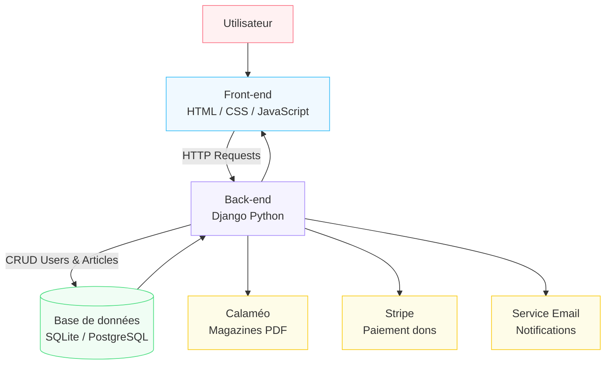
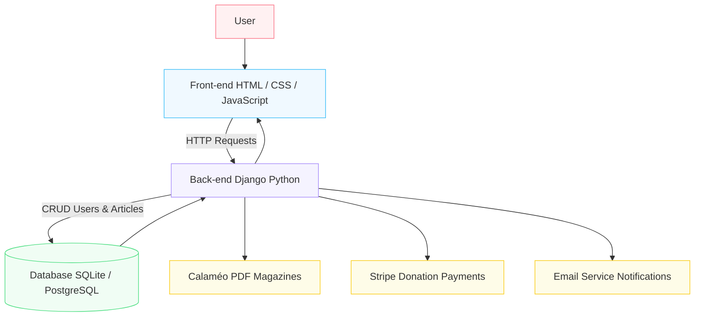
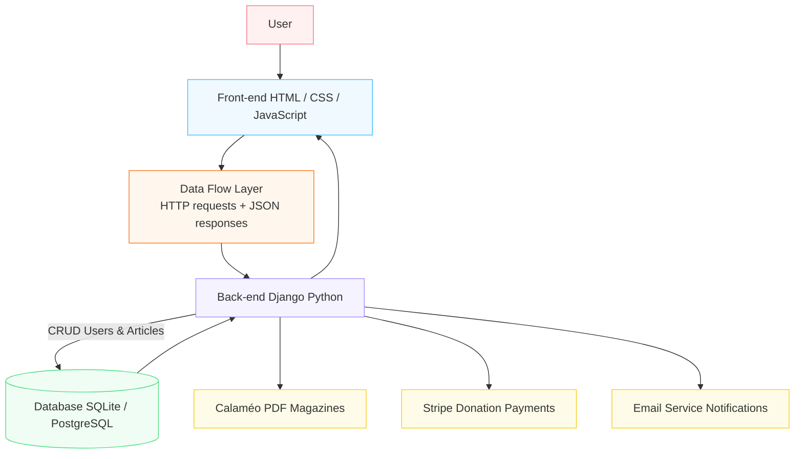

# Portfolio Lioness Magazine


```mermaid
flowchart TD

U[Utilisateur]
FE[Front-end<br/>HTML / CSS / JavaScript]
BE[Back-end<br/>Django Python]
DB[(Base de données<br/>SQLite / PostgreSQL)]
CAL[Calaméo<br/>Magazines PDF]
STRIPE[Stripe<br/>Paiement dons]
EMAIL[Service Email<br/>Notifications]

U --> FE
FE -->|HTTP Requests| BE
BE -->|CRUD Users & Articles| DB
DB --> BE
BE --> FE
BE --> CAL
BE --> STRIPE
BE --> EMAIL

classDef userNode stroke:#fb7185,fill:#fff1f2
classDef frontendNode stroke:#38bdf8,fill:#f0f9ff
classDef backendNode stroke:#a78bfa,fill:#f5f3ff
classDef databaseNode stroke:#4ade80,fill:#f0fdf4
classDef externalNode stroke:#facc15,fill:#fefce8

class U userNode
class FE frontendNode
class BE backendNode
class DB databaseNode
class CAL externalNode
class STRIPE externalNode
class EMAIL externalNode
```
## System Architecture


```mermaid
flowchart TD

U[User]
FE[Front-end HTML / CSS / JavaScript]
BE[Back-end Django Python]
DB[(Database SQLite / PostgreSQL)]
CAL[Calaméo PDF Magazines]
STRIPE[Stripe Donation Payments]
EMAIL[Email Service Notifications]

U --> FE
FE -->|HTTP Requests| BE
BE -->|CRUD Users & Articles| DB
DB --> BE
BE --> FE
BE --> CAL
BE --> STRIPE
BE --> EMAIL

classDef userNode stroke:#fb7185,fill:#fff1f2
classDef frontendNode stroke:#38bdf8,fill:#f0f9ff
classDef backendNode stroke:#a78bfa,fill:#f5f3ff
classDef databaseNode stroke:#4ade80,fill:#f0fdf4
classDef externalNode stroke:#facc15,fill:#fefce8

class U userNode
class FE frontendNode
class BE backendNode
class DB databaseNode
class CAL externalNode
class STRIPE externalNode
class EMAIL externalNode
```


```mermaid
flowchart TD

U[User]

FE[Front-end HTML / CSS / JavaScript]
BE[Back-end Django Python]
DB[(Database SQLite / PostgreSQL)]

CAL[Calaméo PDF Magazines]
STRIPE[Stripe Donation Payments]
EMAIL[Email Service Notifications]

DF[Data Flow Layer\nHTTP requests + JSON responses]

U --> FE
FE --> DF
DF --> BE

BE -->|CRUD Users & Articles| DB
DB --> BE

BE --> FE

BE --> CAL
BE --> STRIPE
BE --> EMAIL

classDef userNode stroke:#fb7185,fill:#fff1f2
classDef frontendNode stroke:#38bdf8,fill:#f0f9ff
classDef backendNode stroke:#a78bfa,fill:#f5f3ff
classDef databaseNode stroke:#4ade80,fill:#f0fdf4
classDef externalNode stroke:#facc15,fill:#fefce8
classDef dataflowNode stroke:#f97316,fill:#fff7ed

class U userNode
class FE frontendNode
class BE backendNode
class DB databaseNode
class CAL externalNode
class STRIPE externalNode
class EMAIL externalNode
class DF dataflowNode
```


```

