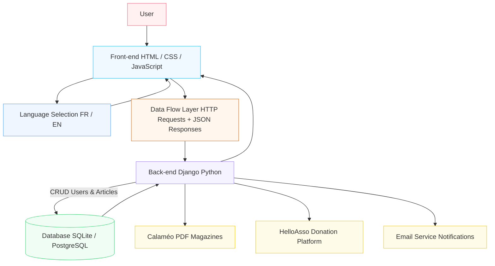
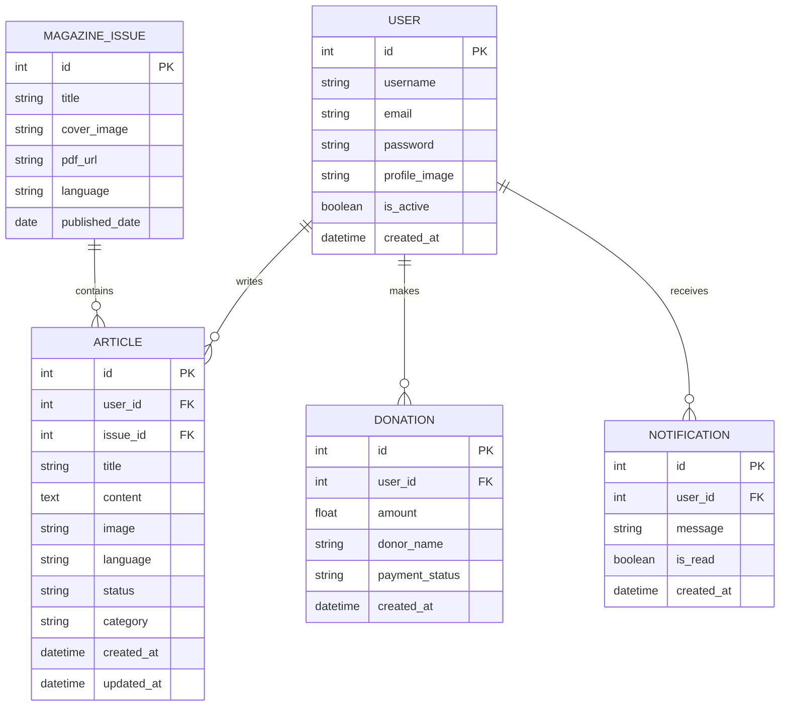
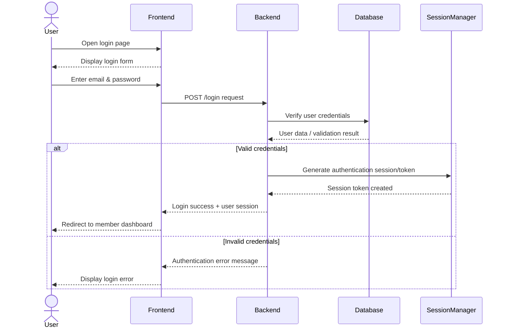
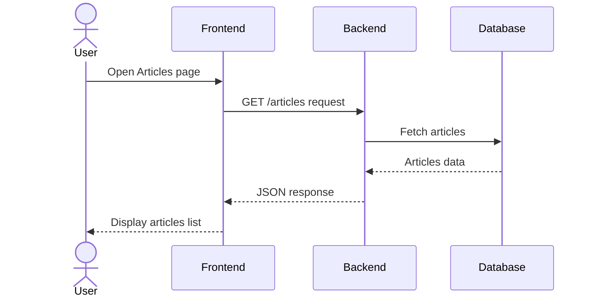
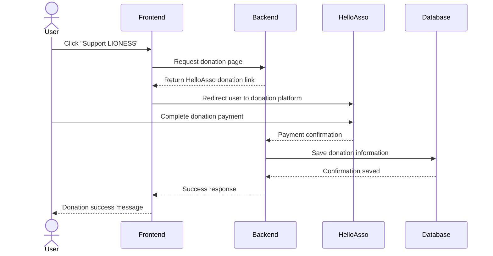
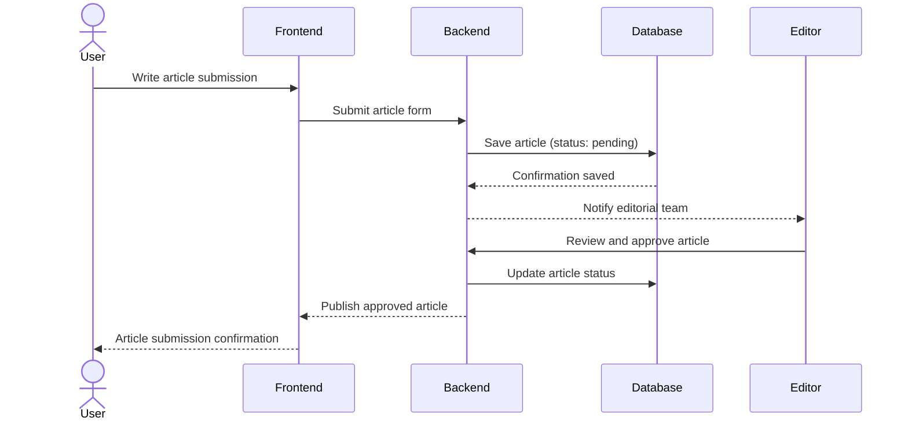

# Portfolio Lioness Magazine

## System Architecture

## ER DIAGRAM

## 1.SEQUENCE DIAGRAM — USER LOGIN

## 2. SEQUENCE DIAGRAM — RETRIEVE ARTICLES

## 3. SEQUENCE DIAGRAM — DONATION (HelloAsso)

## 4. SEQUENCE DIAGRAM — ARTICLE SUBMISSION

